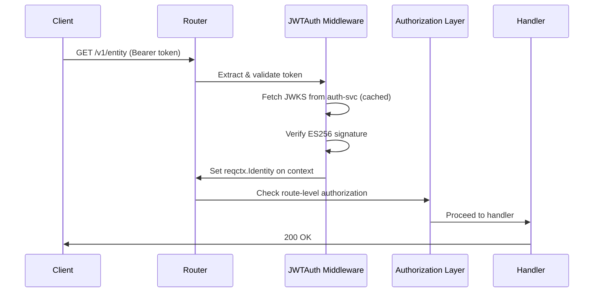

# Architecture

> **WIP** — The orchestration layer (`hh` repo with nginx, frontend, and
> docker-compose) is being updated to reflect the polyrepo split. The
> documentation below describes the target architecture. Individual services
> (hh-auth, hh-users, hh-goals) are functional and tested independently;
> the full integrated stack will be documented once all upstream services
> are complete and wired through nginx.

## Tech Stack

- Go 1.26, Chi router, pgx/v5, goose migrations
- PostgreSQL 18 (one database per service)
- React + Vite + Tailwind (frontend)
- Docker Compose for local dev, GHCR for images
- GitHub Actions for CI/CD

## Authentication Flow

1. Client authenticates via `POST /auth/v1/login` → receives JWT access token + refresh cookie
2. Client sends `Authorization: Bearer <token>` on all subsequent requests
3. Each service validates the JWT against hh-auth's JWKS endpoint (`/v1/jwks`)
4. `middleware.JWTAuth` (from hh-shared) handles validation, key caching, and identity extraction
5. `reqctx.Identity` propagates user/member/role through the request context

### Request Flow

## Data Ownership

Each service owns its database and schema. No cross-service database access.
Services reference members by UUID (from hh-users seed identities defined
in `hh-shared/seeds/identities.go`).

