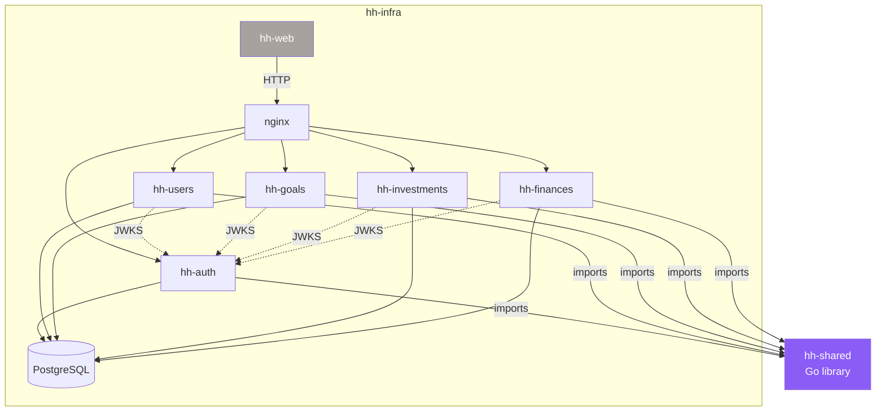
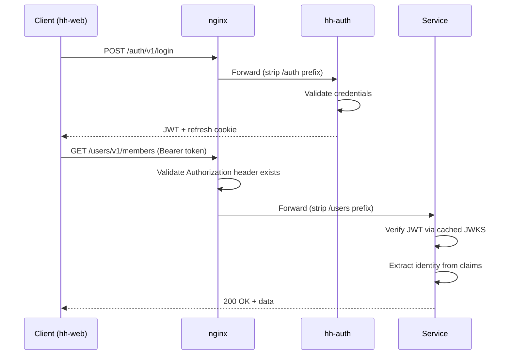
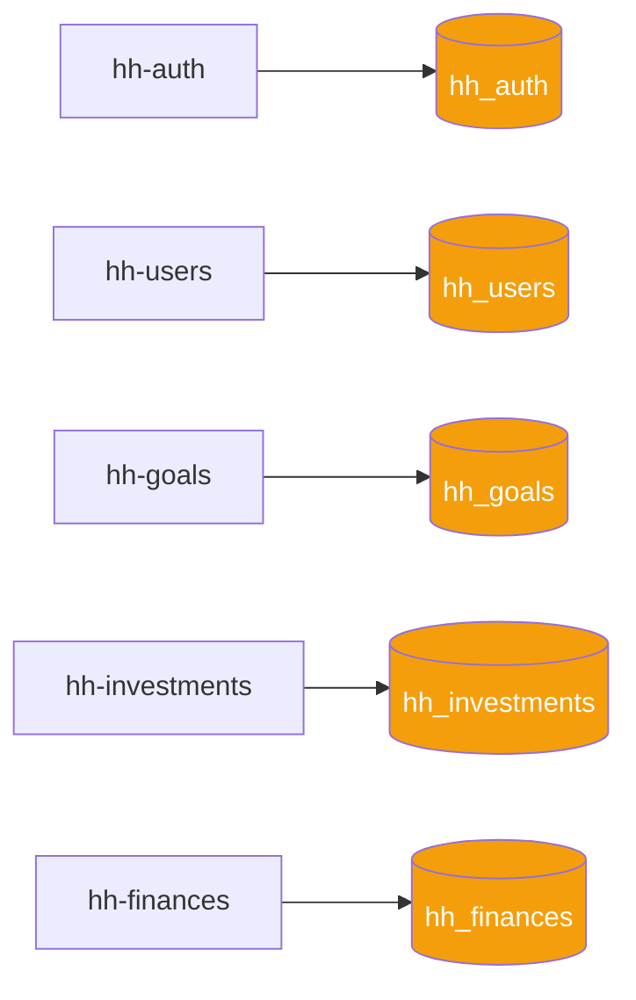

# Architecture

## Tech Stack

- Go 1.26, Chi router, pgx/v5, goose migrations
- PostgreSQL 18 (one database per service)
- React 18 + Vite + Tailwind (frontend — planned as hh-web)
- Docker Compose for local dev, GHCR for images
- GitHub Actions for CI/CD

## Repositories

| Repo | Purpose | Status |
|------|---------|--------|
| hh-auth | Authentication (JWT, JWKS, user accounts) | ✅ Complete |
| hh-users | Household member management | ✅ Complete |
| hh-goals | Savings goals & envelope budgeting | ✅ Complete |
| hh-investments | Investment portfolio tracking | ✅ Complete |
| hh-finances | Income & expense tracking | ✅ Complete |
| hh-web | Frontend SPA (React + Vite) | 📋 Planned |
| hh-shared | Go library (middleware, validation, helpers) | ✅ Complete |
| hh-infra | Orchestration (docker-compose, nginx) | Active |
| hh-docs | Platform documentation (this site) | Active |

## Service Dependencies



Solid lines are current dependencies. Dotted lines are planned or runtime-only (JWKS).

## Authentication Flow



1. Client authenticates via `POST /auth/v1/login` → receives JWT access token + refresh cookie
2. Client sends `Authorization: Bearer <token>` on all subsequent requests
3. nginx validates the header exists (returns 401 if missing), forwards to service
4. Each service validates the JWT against hh-auth's JWKS endpoint (`/v1/jwks`)
5. `middleware.JWTAuth` (from hh-shared) handles validation, key caching, and identity extraction
6. `reqctx.Identity` propagates user/member/role through the request context

### Token Strategy

- Access token: short-lived JWT (1 hour), signed with ES256 (asymmetric)
- Refresh token: long-lived (7 days), stored in httpOnly cookie, rotated on every refresh
- Key management: only hh-auth holds the private signing key; services verify using the public key from JWKS

### JWT Claims

```json
{
  "sub": "user-id",
  "email": "user@example.com",
  "role": "member|admin",
  "member_id": "member-uuid-or-null",
  "iat": 1234567890,
  "exp": 1234571490
}
```

### Authorization

Each service verifies JWT locally and enforces its own rules:

- **hh-auth:** User management is admin-only. Login is unauthenticated. Refresh/logout require any valid token.
- **hh-users:** Members can view all household members; can edit only their own profile. Admins can manage all.
- **hh-goals:** Goals are household-wide (no member-level isolation in v1). All authenticated users can manage goals.
- **hh-investments:** Members can view all household investments; can create/edit/delete only their own. Admins can manage all.
- **hh-finances:** Members can view all household categories and groups; can manage their own accounts, imports, and budgets. Admins can manage all.

Pattern: read access is household-wide (any authenticated user). Write access is restricted by ownership or admin role.

### Roles

- **member** — can read all household data, write only their own data
- **admin** — can read and write everything

## Data Ownership

Each service owns its database and schema. No cross-service database access.



Services reference members by UUID (from hh-users seed identities defined in `hh-shared/seeds/identities.go`). Referential integrity across services is enforced by convention, not by the database.

## API Design Patterns

### Response Envelope

All responses are wrapped in a consistent envelope:

```json
// Success (200, 201)
{ "data": { /* resource or array */ } }

// Error (4xx, 5xx)
{ "error": { "code": "NOT_FOUND", "message": "member not found" } }

// Validation error (422)
{ "error": { "code": "VALIDATION_ERROR", "message": "validation failed", "fields": { "email": "must be a valid email" } } }
```

### HTTP Status Codes

| Code | Meaning | When |
|------|---------|------|
| 200 | OK | Successful GET, PUT |
| 201 | Created | Successful POST |
| 204 | No Content | Successful DELETE |
| 400 | Bad Request | Malformed JSON, missing required field, FK reference not found |
| 401 | Unauthorized | Missing or invalid JWT |
| 403 | Forbidden | Valid JWT but insufficient permissions |
| 404 | Not Found | Resource doesn't exist |
| 409 | Conflict | Unique constraint violation, FK constraint violation |
| 422 | Unprocessable Entity | Validation error (struct-level field errors) |
| 500 | Internal Server Error | Unexpected error |

### Error Codes

Services return typed error codes mapped to HTTP status:
`NOT_FOUND` (404), `CONFLICT` (409), `BAD_REQUEST` (400), `VALIDATION_ERROR` (422), `UNAUTHORIZED` (401), `FORBIDDEN` (403), `INTERNAL` (500).

## Infrastructure

### nginx

Single entry point on `:80`. Strips service path prefix before forwarding:

- Browser: `GET /users/v1/members` → nginx: `GET /v1/members` → `users-svc:8080`

Validates `Authorization` header exists (returns 401 if missing). Blocks internal `/_system/` endpoints.

### Port Mapping

All services use port 8080 internally. Port mapping to different external ports is configured only in the orchestration layer (hh-infra docker-compose and nginx). Individual service repos never document service-specific ports.

### PostgreSQL

Single instance on `:5432`. Each service has its own database, created by `init.sql` on first boot.
