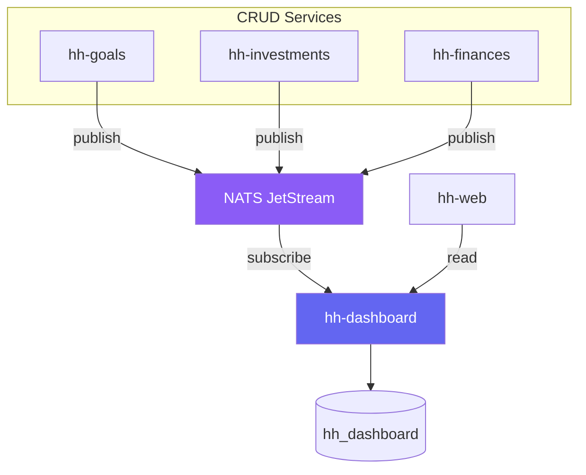

# Dashboard Architecture

Design notes for the planned hh-dashboard service.

## Problem

The existing services (hh-goals, hh-investments, hh-finances) are CRUD-focused.
Their schemas are optimised for transactional writes — normalised tables, per-entity
queries, single-service scope. Dashboard queries require the opposite: aggregations
across entities, time-series rollups, cross-service joins, and per-member breakdowns.

Running these read-heavy queries against the write-optimised databases would:

- Add load to services that should stay fast for CRUD operations
- Require each service to implement its own summary/aggregation logic
- Make cross-service views (e.g. "Alice's total net worth") impossible without
  the frontend stitching data from multiple APIs

## Approach

A dedicated hh-dashboard service that:

1. Subscribes to domain events from CRUD services via NATS JetStream
2. Stores denormalised, read-optimised projections in its own database
3. Serves pre-aggregated dashboard endpoints to the frontend



## Why NATS

NATS is lightweight, operationally simple, and fits the scale of this project.
JetStream provides durable message storage, replay, and consumer groups without
the operational overhead of Kafka. A single NATS server is sufficient — clustering
can be added later if needed.

## Event Contract

### Subject Naming

Subjects follow a three-part convention: `<service>.<domain>.<action>`.

| Subject | When published |
|---|---|
| `goals.account.created` | Account created |
| `goals.movement.created` | Deposit or withdrawal recorded |
| `goals.goal.created` | Goal created |
| `goals.goal.updated` | Goal updated (soft or version change) |
| `goals.goal.status_changed` | Goal completed or cancelled |
| `goals.allocation.upserted` | Allocation created or updated |
| `goals.expense.created` | Expense recorded |
| `investments.entity.created` | Entity (broker/bank) created |
| `investments.instrument.created` | Instrument created |
| `investments.instrument.updated` | Instrument updated (including status change) |
| `investments.contribution.created` | Contribution recorded |
| `investments.valuation.upserted` | Valuation created or updated |
| `finances.transaction.created` | Transaction recorded |
| `finances.transaction.deleted` | Transaction deleted |

Subject constants and the envelope type are defined in `hh-shared` so all
services import them — no string duplication, compile-time safety.

```go
// hh-shared/events/subjects.go
package events

const (
    GoalsMovementCreated       = "goals.movement.created"
    InvestmentsContributionCreated = "investments.contribution.created"
    // ...
)
```

### Envelope Format

Every event uses the same envelope structure. The `payload` field carries the
service-specific data.

```json
{
  "version": 1,
  "subject": "investments.contribution.created",
  "timestamp": "2026-04-06T14:30:00Z",
  "actor": {
    "user_id": "u-123",
    "member_id": "a1a1a1a1-0000-0000-0000-000000000001",
    "role": "member"
  },
  "payload": {
    "id": "c-456",
    "instrument_id": "i-789",
    "amount": "500.00",
    "contributed_on": "2026-04-01"
  }
}
```

| Field | Type | Description |
|---|---|---|
| `version` | int | Envelope schema version (increment on breaking changes) |
| `subject` | string | Matches the NATS subject — redundant but useful for logging/debugging |
| `timestamp` | string | ISO 8601 UTC timestamp of when the event was published |
| `actor` | object | Identity from the JWT that triggered the action |
| `payload` | object | Service-specific data (the created/updated entity) |

The Go type lives in hh-shared:

```go
// hh-shared/events/envelope.go
package events

import "time"

type Actor struct {
    UserID   string `json:"user_id"`
    MemberID string `json:"member_id"`
    Role     string `json:"role"`
}

type Envelope struct {
    Version   int             `json:"version"`
    Subject   string          `json:"subject"`
    Timestamp time.Time       `json:"timestamp"`
    Actor     Actor           `json:"actor"`
    Payload   json.RawMessage `json:"payload"`
}
```

Services publish events by importing the subject constant and constructing
an `Envelope` with the entity as payload. hh-dashboard subscribes by subject
prefix (e.g. `goals.>`, `investments.>`) and deserialises the payload based
on the subject.

### Example: Recording a Contribution

1. User calls `POST /v1/instruments/{id}/contributions` on hh-investments
2. Handler creates the contribution in the database
3. After successful commit, handler publishes to NATS:

```
Subject: investments.contribution.created
Data: {
  "version": 1,
  "subject": "investments.contribution.created",
  "timestamp": "2026-04-06T14:30:00Z",
  "actor": {
    "user_id": "u-123",
    "member_id": "a1a1a1a1-0000-0000-0000-000000000001",
    "role": "member"
  },
  "payload": {
    "id": "c1100001-0000-0000-0000-000000000005",
    "instrument_id": "01000001-0000-0000-0000-000000000001",
    "amount": "500.00",
    "contributed_on": "2026-04-01"
  }
}
```

4. hh-dashboard receives the event, updates the investment projection for
   Alice's portfolio for 2026-04

## Projection Storage

### Schema

Projections are stored as monthly snapshots in a single table. All dashboard
queries filter by `year + month` range — the smallest granularity is one month.

```sql
CREATE TABLE dashboard_snapshots (
    id        UUID        PRIMARY KEY DEFAULT gen_random_uuid(),
    service   TEXT        NOT NULL,  -- 'goals', 'investments', 'finances'
    metric    TEXT        NOT NULL,  -- 'portfolio_summary', 'savings_progress', ...
    member_id UUID,                  -- NULL for household-wide metrics
    year      INT         NOT NULL,
    month     INT         NOT NULL CHECK (month BETWEEN 1 AND 12),
    value     JSONB       NOT NULL,  -- aggregated data for this month
    updated_at TIMESTAMPTZ NOT NULL DEFAULT NOW(),
    UNIQUE (service, metric, member_id, year, month)
);

CREATE INDEX idx_snapshots_lookup
    ON dashboard_snapshots (service, metric, member_id, year, month);
```

The UNIQUE constraint means processing the same event twice (idempotency)
just updates the existing row via upsert.

### Example: Investment Portfolio Snapshot

For Alice, April 2026:

```json
{
  "service": "investments",
  "metric": "portfolio_summary",
  "member_id": "a1a1a1a1-0000-0000-0000-000000000001",
  "year": 2026,
  "month": 4,
  "value": {
    "total_invested": "4750.00",
    "portfolio_value": "5120.00",
    "pct_change": 7.79,
    "instrument_count": 2,
    "by_type": [
      { "type": "ETF", "invested": "2750.00", "value": "3020.00" },
      { "type": "Certificados de Aforro", "invested": "2000.00", "value": "2100.00" }
    ],
    "by_entity": [
      { "entity": "DEGIRO", "invested": "2750.00", "value": "3020.00" },
      { "entity": "CGD", "invested": "2000.00", "value": "2100.00" }
    ]
  }
}
```

### Example: Household Overview Snapshot

For the whole household, April 2026:

```json
{
  "service": "household",
  "metric": "overview",
  "member_id": null,
  "year": 2026,
  "month": 4,
  "value": {
    "total_savings": "12500.00",
    "total_invested": "18200.00",
    "portfolio_value": "19800.00",
    "monthly_expenses": "3200.00",
    "savings_rate": 0.42,
    "by_member": [
      { "member_id": "a1a1...", "savings": "5000.00", "invested": "4750.00" },
      { "member_id": "b2b2...", "savings": "4500.00", "invested": "8200.00" },
      { "member_id": "c3c3...", "savings": "3000.00", "invested": "5250.00" }
    ]
  }
}
```

### Query Pattern

The frontend always queries by month range:

```
GET /v1/dashboard/investments/portfolio?member_id=...&from=2025-01&to=2026-04
```

Returns an array of monthly snapshots. The frontend renders charts from this
time series. Changing the interval (last 3 months, last year, all time) is
just a different `from`/`to` range — always month granularity.

## Projections

| Projection | Service | Scope | Description |
|---|---|---|---|
| `portfolio_summary` | investments | per-member | Total invested, value, % change, by-type, by-entity |
| `savings_progress` | goals | household | Per-goal progress, planned vs actual, savings rate |
| `expense_breakdown` | finances | per-member | Monthly spending by category, trends |
| `overview` | household | household | Cross-service KPIs: net worth, cash flow, savings rate |
| `member_summary` | household | per-member | Per-member view across all services |

## Implementation Phases

### Phase 1 — Foundation
- Set up NATS JetStream in hh-infra
- Define event contract in hh-shared (subjects, envelope type)
- Add NATS publishing to hh-investments (contribution + valuation events)
- Build hh-dashboard with `portfolio_summary` projection
- Single endpoint: `GET /v1/dashboard/investments/portfolio`

### Phase 2 — Goals + Expenses
- Add NATS publishing to hh-goals (movement, allocation, expense events)
- Add NATS publishing to hh-finances (transaction events)
- Build `savings_progress` and `expense_breakdown` projections
- Add corresponding dashboard endpoints

### Phase 3 — Cross-Service Views
- Build `overview` and `member_summary` projections (aggregate across services)
- Household-wide KPIs endpoint
- Per-member unified dashboard endpoint

## Future Improvements

### Replay strategy
Define how to rebuild projections from scratch — options include replaying
retained NATS events, re-fetching from source APIs, or restoring from
database snapshots. Not needed for initial implementation but should be
designed before production use.

### Event schema evolution
As services evolve, event payloads will change. The `version` field on the
envelope enables consumers to handle multiple versions. A formal schema
registry or versioned payload types in hh-shared could be added later.

### Real-time push to frontend
Once projections are maintained, hh-dashboard could push updates to hh-web
via WebSocket or SSE so dashboards refresh without polling.
