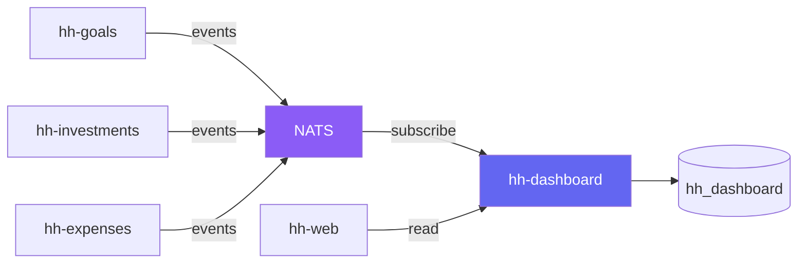

# Dashboard Architecture

Design notes for the planned hh-dashboard service.

## Problem

The existing services (hh-goals, hh-investments, hh-expenses) are CRUD-focused.
Their schemas are optimised for transactional writes — normalised tables, per-entity
queries, single-service scope. Dashboard queries require the opposite: aggregations
across entities, time-series rollups, cross-service joins, and per-member breakdowns.

Running these read-heavy queries against the write-optimised databases would:

- Add load to services that should stay fast for CRUD operations
- Require each service to implement its own summary/aggregation logic
- Make cross-service views (e.g. "Alice's total net worth") impossible without
  the frontend stitching data from multiple APIs

## Approach

A dedicated hh-dashboard service that:

1. Consumes events from CRUD services (via a message broker like NATS)
2. Stores denormalised, read-optimised projections in its own database
3. Serves pre-aggregated dashboard endpoints to the frontend

## Data Flow

CRUD services publish domain events when data changes:

- `goal.created`, `goal.updated`, `movement.recorded`, `allocation.created`
- `instrument.created`, `contribution.recorded`, `valuation.recorded`
- `transaction.created`, `category.updated`

hh-dashboard subscribes to these events and updates its projections. The
projections are denormalised views optimised for the specific dashboard
queries the frontend needs.

## Projections

Examples of what hh-dashboard would materialise:

| Projection | Source | Use case |
|---|---|---|
| Portfolio summary | hh-investments events | Total invested, portfolio value, % change, by-type/by-entity breakdowns |
| Savings progress | hh-goals events | Per-goal progress, planned vs actual, household savings rate |
| Expense breakdown | hh-expenses events | Monthly spending by category, trends, budget vs actual |
| Member overview | All services | Per-member net worth, savings, investments, expenses |
| Household KPIs | All services | Total household net worth, monthly cash flow, savings rate |

## Benefits

- CRUD services stay simple and fast — no aggregation logic
- Dashboard queries are cheap reads against pre-computed data
- Cross-service views become possible without frontend stitching
- Event-driven: dashboards update automatically when data changes
- Can be rebuilt from scratch by replaying events

## Open Questions

- NATS vs other brokers (Kafka, Redis Streams) — NATS is lightweight and fits the scale
- Event schema versioning — how to handle schema evolution
- Replay strategy — full rebuild vs incremental catch-up
- Latency tolerance — how stale can dashboard data be? (seconds is likely fine)
- Whether to start with polling (simpler) and migrate to events later
