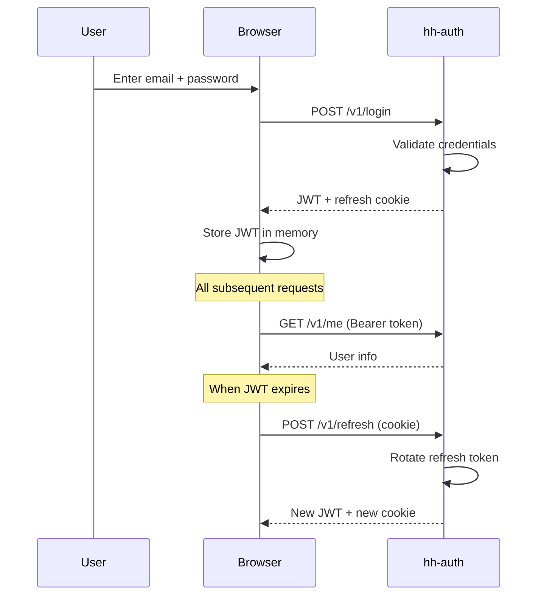

# Authentication

Every action in the platform requires authentication. Household uses
email + password login with JWT-based sessions.

## How it works

1. You log in with your email and password
2. The system returns a short-lived access token (JWT) and sets a refresh cookie
3. Your browser sends the access token with every API request
4. When the access token expires, the refresh cookie is used to get a new one — no re-login needed
5. Logging out clears the refresh cookie

## Security

- Passwords are stored as bcrypt hashes — never in plaintext
- Access tokens are signed with ES256 (elliptic curve) and are short-lived
- Refresh tokens are rotated on every use — the old one is invalidated
- The signing key is generated on first startup and stored in a Docker volume — it never enters environment variables, Git, or container images
- Other services verify tokens independently using the public key — they never call the auth service per-request

## Roles

- **Admin** — full access to all resources, can manage users and members
- **Member** — can view household data and edit their own profile

## Limitations

- No password reset yet (planned)
- No OAuth / social login — email + password only
