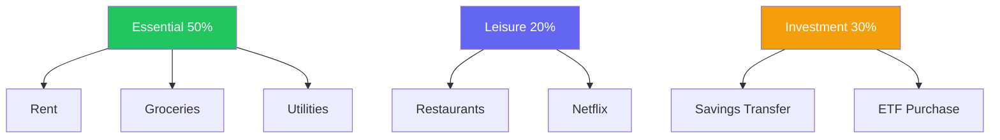

# Finances

Household tracks income and expenses for each member. The primary input
method is importing bank statements as Excel files — the app parses
transactions automatically and organises them by category and budget group.

## Why import-based?

Rather than manually typing every transaction, members export their bank
statement each month and upload it. The app reads the file, stores all
transactions, and links them to categories. This keeps the data accurate
(it matches the bank) and the effort low (one upload per month per member).

## Core concepts

### Categories
Fine-grained labels for transactions — "Groceries", "Salary", "Netflix".
Each category has a type (`expense` or `income`), a color, and an icon.
Categories are household-wide (shared by all members).

### Category Groups
Budget buckets that organise expense categories — "Essential", "Leisure",
"Investment". Each group has a target percentage of monthly income. Only
expense categories can belong to a group; income categories are ungrouped.

### Accounts
Bank or payment accounts belonging to a member — "CGD Conta Ordem",
"Revolut". Accounts are auto-discovered during Excel import (the parser
extracts the account name from the file) but can also be created manually.

### Transactions
Individual financial movements parsed from an imported file. Each
transaction has a type (income or expense), amount, date, description,
and is linked to a category and an account. Transactions belong to a
member through their file import.

### File Imports
One Excel upload per member per month. Re-uploading the same month
replaces the previous import (cascade deletes old transactions). The
import records the filename, row count, and timestamp.

### Budgets
A versioned income and allocation snapshot per member. When a member
declares their monthly income, the system computes how much each category
group should receive based on the group's target percentage. A new budget
version is created whenever income or allocation targets change — old
versions are never mutated.

## Example flow

1. Admin creates category groups: "Essential" (50%), "Leisure" (20%), "Savings" (30%)
2. Categories are created: "Rent" → Essential, "Groceries" → Essential, "Netflix" → Leisure, etc.
3. Alice sets her budget: income €3,000/month → Essential gets €1,500, Leisure €600, Savings €900
4. At month end, Alice exports her bank statement and uploads the Excel file
5. The app parses 87 transactions, links them to categories and her account
6. Alice can now see her transactions organised by category and group
