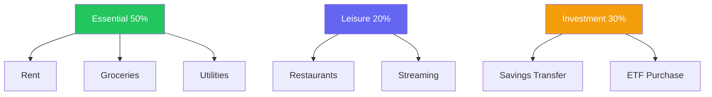

# Finances

Household tracks income and expenses for each member. The primary input
method is importing CSV files — the app parses transactions automatically
and organises them by category and budget group.

## Why import-based?

Rather than manually typing every transaction, members export their statement
each month and upload a CSV. The app reads the file, stores all transactions,
and links them to categories. This keeps the data accurate and the effort
low (one upload per month).

## CSV Format

The import expects a CSV file with the following columns:

```csv
Date,Person,Type,Amount,Currency,Category,Description
2026-01-04,Alice,expense,20,EUR,Health,Pharmacy
2026-01-25,Alice,income,3000,EUR,Salary,January salary
```

| Column | Required | Description |
|--------|----------|-------------|
| Date | Yes | Transaction date (YYYY-MM-DD) |
| Person | Yes | Member name (resolved to member ID) |
| Type | Yes | `expense` or `income` |
| Amount | Yes | Positive decimal value |
| Currency | No | Currency code (informational) |
| Category | Yes | Category name (must exist in the system) |
| Description | No | Free-text description |

The "Person" column is resolved to a member ID by calling the identity service.
This allows a single CSV to contain transactions for multiple household members.

## Core concepts

### Categories
Fine-grained labels for transactions — "Groceries", "Salary", "Streaming".
Each category has a type (`expense` or `income`), a color, and an icon.
Categories are household-wide (shared by all members).

### Category Groups
Budget buckets that organise expense categories — "Essential", "Leisure",
"Investment". Each group has a target percentage of monthly income. Only
expense categories can belong to a group; income categories are ungrouped.


```mermaid
graph TD
    G1[Essential 50%] --> C1[Rent]
    G1 --> C2[Groceries]
    G1 --> C3[Utilities]
    G2[Leisure 20%] --> C4[Restaurants]
    G2 --> C5[Streaming]
    G3[Investment 30%] --> C6[Savings Transfer]
    G3 --> C7[ETF Purchase]

    style G1 fill:#22c55e,color:#fff
    style G2 fill:#6366f1,color:#fff
    style G3 fill:#f59e0b,color:#fff
```

### Transactions
Individual financial movements parsed from an imported CSV. Each
transaction has a type (income or expense), amount, date, description,
and is linked to a category and a member directly. There is no intermediate
"account" concept — transactions belong to a member.

### File Imports
One CSV upload per member per month. Re-uploading the same month
replaces the previous import (cascade deletes old transactions). The
import records the filename, row count, and timestamp.

### Budgets
A versioned income and allocation snapshot per member. When a member
declares their monthly income, the system computes how much each category
group should receive based on the group's target percentage. A new budget
version is created whenever income or allocation targets change — old
versions are never mutated.

## Example flow

1. Admin creates category groups: "Essential" (50%), "Leisure" (20%), "Savings" (30%)
2. Categories are created: "Rent" → Essential, "Groceries" → Essential, "Streaming" → Leisure, etc.
3. Alice sets her budget: income €3,000/month → Essential gets €1,500, Leisure €600, Savings €900
4. At month end, Alice prepares a CSV with her transactions and uploads it
5. The app parses the CSV, resolves "Alice" to her member ID, links transactions to categories
6. Alice can now see her transactions organised by category and group
