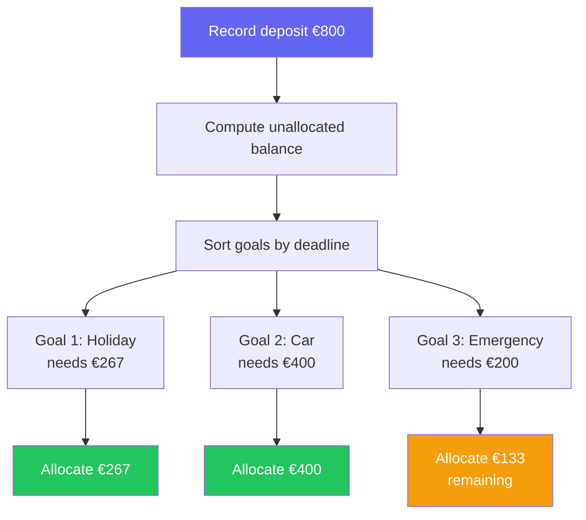

# Savings Goals

Household uses envelope budgeting for savings. Instead of tracking money
passively, every saved euro gets a job — assigned to a named goal with a
budget and a deadline.

## Why envelopes?

Many households save vaguely without a clear destination. By dividing savings
into named envelopes — holidays, a car, an emergency fund — it becomes easier
to see progress, stay motivated, and make trade-offs when budgets are tight.

## Core concepts

### Accounts
Real bank or savings accounts. Balances are always derived by summing all
movements — never stored directly. This keeps the balance accurate and
consistent.

### Goals
Named saving envelopes. Each goal has a color, icon, budget, target date,
and start date. Goals are household-wide (not per-member in v1).

A goal moves through statuses: **planned** (start date in the future) →
**active** (start date reached) → **completed** or **cancelled**.

### Deposits and auto-distribution
When you record a deposit into an account, the system automatically
distributes it across active goals. Goals closest to their deadline get
funded first. If there's money left over after all goals are satisfied for
the month, it stays as unallocated balance.

### Allocations
Each goal has a monthly plan (budget ÷ months). As deposits come in, actual
allocations are created. The gap between planned and actual drives the
"met / partial / missed" status shown in the UI.

### Expenses
Spending from a goal's virtual envelope. Recording an expense reduces the
goal balance without touching any real account. This lets you track how much
of a goal's budget has actually been spent.

### Versions
When you change a goal's budget or target date, a new version is created.
Past months keep their original plan. This preserves history and makes it
easy to see how a savings plan evolved over time.

## Example flow

1. Create an account "Main Savings"
2. Create a goal "Summer Holiday" — budget €3,200, target June 2027
3. Each month, record a deposit of €800 into Main Savings
4. The system auto-distributes €267/month to Summer Holiday (and to other active goals)
5. Book flights → record an expense of €450 against Summer Holiday
6. When the holiday is done, mark the goal as completed
