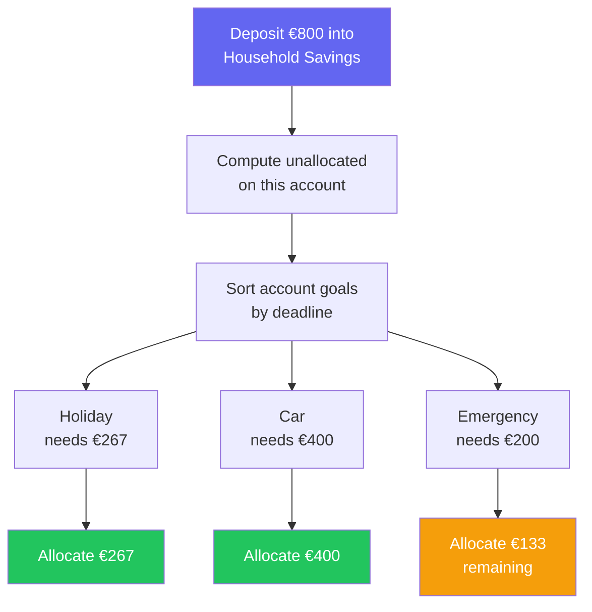

# Savings Goals

Household uses envelope budgeting for savings. Instead of tracking money
passively, every saved euro gets a job — assigned to a named goal with a
budget and a deadline.

## Why envelopes?

Many households save vaguely without a clear destination. By dividing savings
into named envelopes — holidays, a car, an emergency fund — it becomes easier
to see progress, stay motivated, and make trade-offs when budgets are tight.

## Core concepts

### Accounts

Savings accounts that hold real money. Each account has a derived balance
(sum of all movements). Accounts come in two flavours:

- **Household account** (`member_id = NULL`) — shared by everyone. Only one
  can exist. Household goals (holidays, shared purchases) live here.
- **Personal account** (`member_id` set) — owned by one member. Each member
  can have at most one. Personal goals (mortgage overpayment, individual
  savings) live here.

If a member has no personal account, they only interact with the household
account.

### Goals

Named saving envelopes. Each goal belongs to exactly one account. A goal has
a color, icon, budget, target date, and start date.

A goal moves through statuses: **planned** (start date in the future) →
**active** (start date reached) → **completed** or **cancelled**.

When a goal is completed with a positive balance, the surplus can optionally
be returned to an account as a movement. If no account is selected, the
surplus stays as unallocated balance on the goal's account.

### Deposits and auto-distribution

When you record a deposit into an account, the system automatically
distributes it across **active goals on that account**. Goals closest to
their deadline get funded first. If there's money left over after all goals
are satisfied for the month, it stays as unallocated balance on that account.


```mermaid
graph TD
    D[Deposit €800 into<br/>Household Savings] --> C[Compute unallocated<br/>on this account]
    C --> S[Sort account goals<br/>by deadline]
    S --> G1[Holiday<br/>needs €267]
    S --> G2[Car<br/>needs €400]
    S --> G3[Emergency<br/>needs €200]
    G1 --> A1[Allocate €267]
    G2 --> A2[Allocate €400]
    G3 --> A3[Allocate €133<br/>remaining]

    style D fill:#6366f1,color:#fff
    style A1 fill:#22c55e,color:#fff
    style A2 fill:#22c55e,color:#fff
    style A3 fill:#f59e0b,color:#fff
```

### Allocations

Each goal has a monthly plan (budget ÷ months). As deposits come in, actual
allocations are created. The gap between planned and actual drives the
"met / partial / missed" status shown in the UI.

### Expenses

Spending from a goal's virtual envelope. Recording an expense reduces the
goal balance without touching any real account. This lets you track how much
of a goal's budget has actually been spent.

### Versions

When you change a goal's budget or target date, a new version is created.
Past months keep their original plan. This preserves history and makes it
easy to see how a savings plan evolved over time.

## Account → Goal relationship

The relationship between accounts and goals mirrors the entity → instrument
pattern in the investments module:

```
Household Savings (member_id = NULL)
├── Summer Holiday (shared goal)
├── Car Fund (shared goal)
└── Emergency Fund (shared goal)

Alice's Savings (member_id = Alice)
└── Mortgage Overpayment (personal goal)
```

- Deposits into "Household Savings" only distribute to goals on that account
- Deposits into "Alice's Savings" only distribute to Alice's personal goals
- Surplus from a completed goal stays in the same account

## Example flow

1. Create a household account "Household Savings"
2. Create a personal account "Alice's Savings"
3. Create a shared goal "Summer Holiday" on Household Savings — budget €3,200
4. Create a personal goal "Mortgage Extra" on Alice's Savings — budget €2,000
5. Each month, deposit €800 into Household Savings → auto-distributes to shared goals
6. Each month, deposit €200 into Alice's Savings → auto-distributes to Alice's goals
7. Book flights → record an expense of €450 against Summer Holiday
8. When the holiday is done, mark the goal as completed — surplus stays in Household Savings
