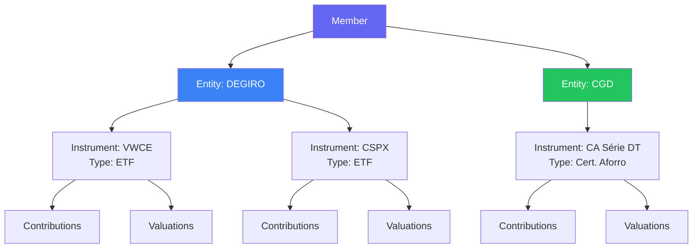

# Investments

Household tracks personal investment portfolios for each member. The focus
is on manual, deliberate tracking rather than automated market data.

## Why manual tracking?

Many investment apps pull live prices automatically. Household takes a
different approach: members manually record what they invested and what
it's worth each month. This creates a deliberate ritual of checking in
on your portfolio and builds a personal history of investment decisions.

## Core concepts

### Investment Types
Categories like ETF, Stock, Bond, PPR, Certificados de Aforro. The service
ships with sensible defaults, but members can add or remove types.

### Entities
Financial institutions — brokers (DEGIRO, IBKR), banks (CGD, Millennium),
or state programs. Each member manages their own set of entities.

### Instruments
Specific investment positions. "VWCE at DEGIRO" or "PPR at Millennium".
Each instrument belongs to one member, one entity, and one type.
Instruments can be closed to preserve history without deleting data.

### Contributions
Money added to an instrument. Each contribution records an amount and
date. Over time this builds a complete history of cash invested.

### Valuations
Monthly snapshots of what an instrument is worth. One per instrument
per month. The difference between total contributions and latest
valuation shows the gain or loss.

## Example flow

1. Create an entity "DEGIRO" for Alice
2. Create an instrument "VWCE" (type: ETF, entity: DEGIRO)
3. Record a contribution of €500 on January 15th
4. At month end, record a valuation of €510 for January
5. Next month, another €500 contribution and a valuation of €1,045
6. Over time, the contribution and valuation history shows portfolio growth
