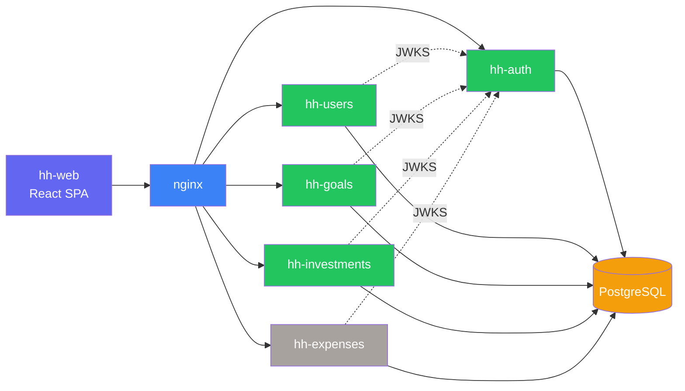

# Household Platform

A personal household management platform that helps families track and organise
their shared finances — members, savings goals, and investments — through a set
of independently deployed microservices.

## What it does

Household gives a family a single place to manage money together:

- **Members** — define who's in the household (names, avatars, roles)
- **Authentication** — secure login with email and password, JWT-based sessions
- **Savings goals** — envelope budgeting where every saved euro gets a job
- **Auto-distribution** — deposits are automatically split across active goals by urgency
- **Investments** — track investment instruments, contributions, and valuations
- **Expenses** — record spending against goals to see real progress *(service planned)*

## Platform overview

Solid lines are HTTP requests. Dotted lines show JWKS key fetching (cached, not per-request).
Grey indicates planned services.

## How to navigate this site

| Section | Audience | What you'll find |
|---|---|---|
| [Features](features/auth.md) | Anyone | What the platform does, how it works for users |
| [Roadmap](roadmap.md) | Anyone | Feature backlog and future improvements |
| [Developers](architecture.md) | Developers | Architecture, conventions, per-service details |
